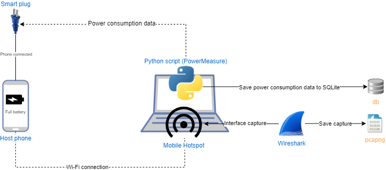
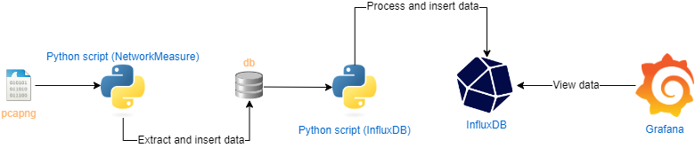

This repository has scripts to monitor an Android smartphone's energy consumption and Internet traffic.
There are four main scripts:
1. [PowerMeasure](PowerMeasure)
2. [NetworkMeasure](NetworkMeasure)
3. [PowerNetworkCharts](PowerNetworkCharts)
4. [InfluxBD](InfluxBD)

The scripts can be used in the specified order to get all the data or can be used separately to get specific data.
1. Allows to measure and save energy consumption data using a smart plug which supports REST API. It allows one to view data in real-time on a line chart, save it to an SQLite database and generate line charts.
2. Allows to extract IP packets from a pcapng and save it to an SQLite database. It allows also the generation of a line chart of the packets/frequency or total bytes/frequency.
3. Allows generating a scatter plot combining the data from the energy consumption and Internet traffic.
4. Allows to save the energy consumption data and to process and save the Internet traffic data to an InfluxDB bucket to view it on Grafana.

Each script has its own README where are explained the details. Each script also has its own requirements.txt, otherwise, the one in the root directory can be used to install all the dependencies.

The following diagram shows a possible methodology to monitor and save energy consumption and Internet traffic data using the scripts.

The following diagram shows a possible methodology to visualize the data on Grafana.

